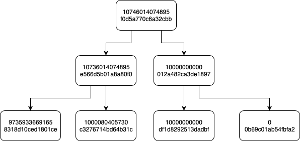

## 100%准备金证明

本设计将用于证明平台拥有100%的用户资产储备金。

证明算法参考了[proving-bitcoin-reserves](https://iwilcox.me.uk/2014/proving-bitcoin-reserves)，进行了些许调整，通过采用默克尔树等技术，在保证隐私的基础上，公开用户的数字资产储备证明。 

我们有责任和义务解决用户对于数字资产平台透明度的需求。我们将以比特币为起点，逐步公布其他数字资产贮备。

## 证明机制
以下步骤针对单一资产，多资产生成多份证明机制即可。
#### 步骤一 公布平台资产
平台公布资产的持币地址，证明其拥有的资产储备总额数量。

#### 步骤二 生成用户节点数据
平台根据用户的资产数据，通过如下步骤生成用户结点数据：
* 每个用户具有 `userid,amount`
* 通过算法为每个用户生成 `userid,amount,nonce,hashid`
hash函数为
```
def hash_func(userid, nonce, amount):
    inputstr = userid + str(nonce) + str(amount)
    hashstr  = hashlib.sha256(inputstr.encode("utf-8"))
    hashid   = hashstr.hexdigest()[0:HASHLEN * 2]
    return hashid
```
系统根据展示需求，可以选取部分hash值截断展示（本函数中，`HASHLEN=8`）。

* 通过算法根据用户节点生成平衡的Merkle树，非平衡的结点进行零资产结点填充。
以BTC资产为例，图中数量单位为聪，资产Merkle树类似的结构如下：

#### 步骤三 用户验证资产
* 用户可以下载平台完整的平衡Merkle树数据。
* 首先验证平台公布的持币地址资产是否大于等于Merkle资产树的根结点数字资产数量，如果大于等于，则证明平台拥有大于等于100%的用户储备金。
* 用户可以根据app端展示的nonce等相关数据，按照上述描述的hash函数，自行计算hashID，然后在平衡Merkle树中自行搜索查找叶子结点，证明用户资产在平台公布的储备数字资产中。
* 用户可以公布上述过程与数据。
具体示例可以参考 [验证示例](./Validate.md)

所有用户都可以采用上述流程进行验证。
* 所有用户都能确认自己的资产数目在平台公布的储备资产数据中。
* 没有任何用户提出资产数据被重复验证或者伪造。
* 在上述两点满足的情况下，通过上述步骤即可证明平台拥有100%储备数字资产。


